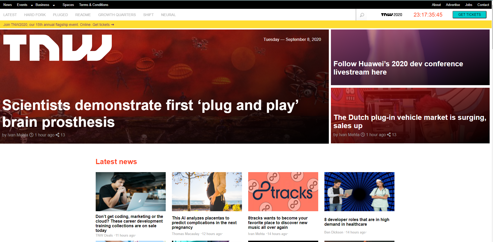

# Building with Responsive Design

Building with Responsive Design using Media Queries

#HTML and CSS: Design Teardown

We created a Responsive WEbsite using media Queries
We applied flex boxes, floats, and CSS grids.

## Built With

- HTML,
- CSS,

## Live Demo

[Live Demo Link](https://cvilla714.github.io/responsivedesign/)

👤 **Cosmel Villalobos**

- Github: [@cvilla714](https://github.com/cvilla714)
- Twitter: [@kckeyti](https://twitter.com/kckeyti)
- LinkedIn: [Cosmel Villalobos](https://www.linkedin.com/in/cosvilla/)

👤 **Bigwizzo**

- Github: [@githubhandle](https://github.com/Bigwizzo)
- Twitter: [@twitterhandle](https://twitter.com/willnyamunokora)
- Linkedin: [linkedin](https://www.linkedin.com/in/willnyamunokora)
